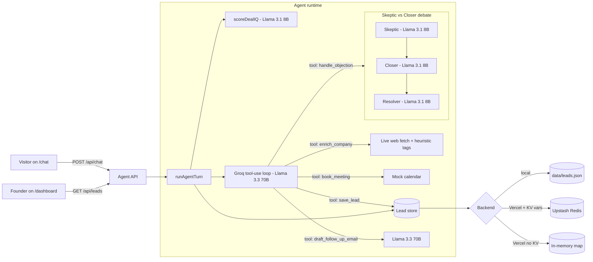
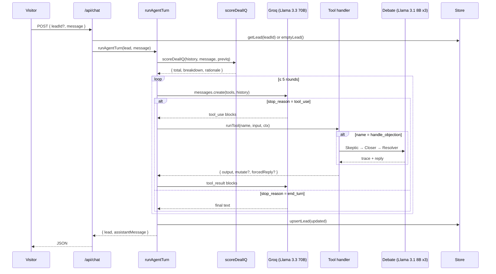

# ClosrAI Architecture

A single Next.js 16 app that bundles the visitor chat surface, the founder dashboard, and the agent runtime. Deploys to Vercel as one unit. No external services required to run locally; Upstash Redis is supported (and auto-detected) for persistence on serverless.

---

## High-level

---

## Agent turn lifecycle

---

## Why these choices

- **Tool-use as the spine.** Every visible action (enrich, book, save, email) is a real, observable tool call. This makes the agent's behavior auditable — judges can see exactly what it did, not just what it said.
- **Skeptic-vs-Closer routed through `handle_objection`.** The main SDR prompt instructs the agent to *route* objections, not improvise responses. This forces the debate code path on every objection, making the novelty mechanism reliable in demo.
- **Model split.** Opus 4.7 only on two surfaces (main SDR + email draft) where quality matters. Haiku 4.5 for the 4 latency-sensitive calls per debate (and the scorer). Roughly 70% latency reduction vs all-Opus, with no quality loss on the debate roles in practice.
- **Prompt caching** on the long SDR system prompt (`cache_control: ephemeral`). Saves tokens across multi-turn conversations.
- **Zero-config persistence.** Local: JSON file. Vercel + Upstash env vars: Redis. Vercel without KV: in-memory (per-instance, fine for demo). Single import, three backends, picked at first call.
- **No vector DB.** This product surface doesn't need RAG. Adding Pinecone/Chroma would inflate complexity without scoring more points on any of the 4 judging dimensions. Deliberate scope choice.

---

## Module map

| File | Responsibility |
|---|---|
| `src/agent/core.ts` | Orchestrator: scores the turn, runs the tool-use loop, updates lead state |
| `src/agent/client.ts` | Anthropic SDK singleton + model ID constants |
| `src/agent/prompts.ts` | Every system prompt in one file (single source of truth) |
| `src/agent/tools.ts` | 5 tool definitions + handlers |
| `src/agent/debate.ts` | Skeptic / Closer / Resolver sub-system |
| `src/agent/dealiq.ts` | 7-dimensional lead scorer (LLM + heuristic fallback) |
| `src/lib/store.ts` | Backend-picking lead store (Upstash / file / memory) |
| `src/lib/types.ts` | Shared TypeScript types |
| `src/app/api/chat/route.ts` | POST handler — validates with zod, runs the agent, persists |
| `src/app/api/leads/*` | GET handlers for dashboard reads |
| `src/components/ChatWidget.tsx` | Visitor-facing widget (client component) |
| `src/components/DealIQGauge.tsx` | Animated ring + breakdown bars |
| `src/components/DebatePanel.tsx` | Inline objection-debate display |
| `src/app/page.tsx` | Marketing landing |
| `src/app/chat/page.tsx` | Visitor chat page |
| `src/app/dashboard/page.tsx` | Lead list + stats |
| `src/app/dashboard/[id]/page.tsx` | Lead detail with transcript, debate, email draft |
